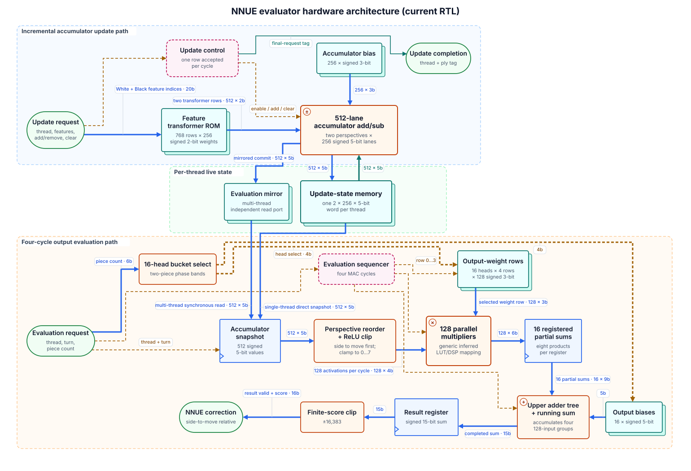

# RTL Architecture Diagram Codex skill

A repo-local Codex skill for turning RTL into compact, deterministic SVG architecture/microarchitecture diagrams.

## Example

The NNUE evaluator datapath is defined as semantic JSON and rendered with the bundled deterministic renderer.

[](examples/nnue-evaluator.svg)

[Diagram IR](examples/nnue-evaluator.diagram.json) · [Rendered SVG](examples/nnue-evaluator.svg)

Agents and Markdown renderers that support SVG can preview the generated file directly; no PNG conversion or separate rendering step is needed:

```markdown

```

## Install

Copy the included `.agents/` directory into the root of your repository. Codex discovers repo skills under `.agents/skills`.

Then invoke it explicitly when desired:

```text
$rtl-architecture-diagram draw the transposition-table microarchitecture
```

Or ask naturally for an RTL architecture/datapath diagram; the skill description is written so Codex can select it implicitly.

## Repository layout

```text
.agents/skills/rtl-architecture-diagram/
├── SKILL.md                 Agent workflow and abstraction rules
├── agents/openai.yaml       Skill discovery metadata
├── assets/icon.svg          Skill icon
├── examples/                Small bundled smoke-test diagram
├── references/IR.md         Complete JSON IR reference
└── scripts/render.py        Portable standard-library renderer and CLI
examples/                    Repository-level showcase diagrams
tests/                       Focused CLI, IR, layout, routing, and SVG suites
```

The renderer intentionally remains one dependency-free script so the `.agents/` directory can be copied into another repository without packaging or installation work. Its source is divided into explicit sizing, IR, layout, routing, label, SVG, and lint sections.

## Test the renderer

From the skill directory:

```bash
python scripts/render.py examples/tt.diagram.json -o /tmp/tt.svg --lint --strict
```

The renderer uses only the Python standard library.

From the repository root, run the regression suite:

```bash
python -m unittest discover -s tests -v
```

The suite checks the CLI, deterministic output, automatic and anchored semantic placement, endpoint and label geometry, routing diagnostics, SVG escaping, and invalid-IR handling without installing dependencies.

## Architecture

Codex owns semantic interpretation: the diagram boundary, architectural blocks, connections, and source evidence. It emits a compact JSON IR. The renderer owns deterministic geometry, including:

- automatic or anchored placement;
- node sizing and hardware symbols;
- exact port attachment and orthogonal routing;
- collision-aware labels and geometric linting;
- SVG styling and output.

Block `at:[column,row]` values are optional. Missing ranks and lanes are inferred from connectivity, block kinds, groups, and any explicit anchors. Revise semantic JSON rather than hand-editing generated SVG coordinates.

## Built-in hardware notation

Supported blocks include modules, generic logic, memories, FIFOs, muxes/demuxes, registers, counters, FSMs, arbiters, I/O, ALUs, adders, subtractors, selectable add/sub units, multipliers, comparators, and meaningful AND/OR/XOR/NOT gates.

The visual conventions include:

- explicit arithmetic-operation badges and register clock notches;
- thicker bus routes with shaft-safe broad arrowheads;
- signal-semantic colors for data, control, clock, and response paths;
- two-line title/subtitle wrapping and optional `bigger`/`smaller` prominence;
- compact group-aware layout with long-row folding and support shelves;
- straight singleton links, clear cross-group corridors, and aligned group frames;
- quiet label placement with collision-aware orthogonal leaders;
- a centered diagram title and dependency-free UI font stack.
